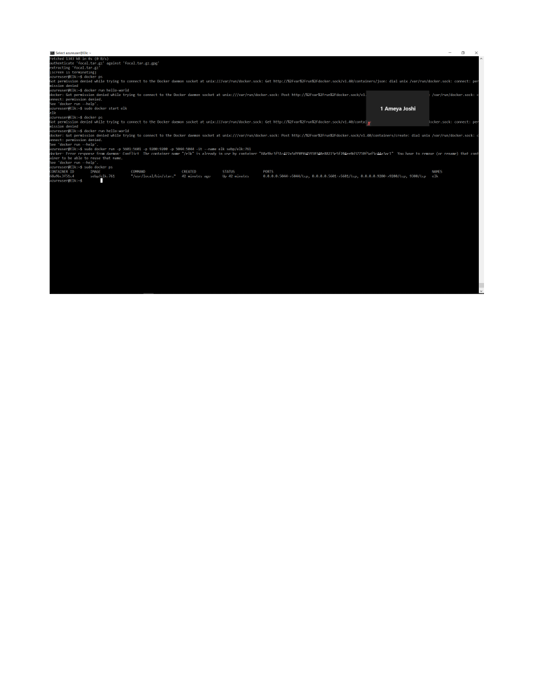

# Automated ELK Stack Deployment

<b>by Ameya</b>

The files in this repository were used to configure the network depicted below.

These files have been tested and used to generate a live ELK deployment on Azure. They can be used to either recreate the entire deployment pictured above. Alternatively, select portions of the install-elk.yml file may be used to install only certain pieces of it, such as Filebeat.

  - install-elk.yml _
	---
- name: Configure Elk VM with Docker
  hosts: 10.1.0.4
  remote_user: azureuser
  become: true
  tasks:
    # Use apt module
    - name: Install docker.io
      apt:
        update_cache: yes
        force_apt_get: yes
        name: docker.io
        state: present

      # Use apt module
    - name: Install python3-pip
      apt:
        force_apt_get: yes
        name: python3-pip
        state: present

      # Use pip module (It will default to pip3)
    - name: Install Docker module
      pip:
        name: docker
        state: present

    - name: Use more memory
      sysctl:
        name: vm.max_map_count
        value: "262144"
        state: present
        reload: yes
      # Use command module

      # Use docker_container module
    - name: download and launch a docker elk container
      docker_container:
        name: elk
        image: sebp/elk:761
        state: started
        restart_policy: always
      # Please list the ports that ELK runs on
        published_ports:
          - 5601:5601
          - 9200:9200
          - 5044:5044

      # Use systemd module
    - name: Enable service docker on boot
      systemd:
        name: docker
        enabled: yes

This document contains the following details:
- Description of the Topologu
- Access Policies
- ELK Configuration
  - Beats in Use
  - Machines Being Monitored
- How to Use the Ansible Build

### Description of the Topology

The main purpose of this network is to expose a load-balanced and monitored instance of DVWA, the D*mn Vulnerable Web Application.

Load balancing ensures that the application will be highly avialble, in addition to restricting access to the network.
- _TODO: A load balancer provides a website with an external IP that is accessed from the internet. Load balancers receive traffic that comes to the website and distributes the traffic across many servers. The distribution of the traffic mitigates the possibility of a DoS attack. A jump box is a gateway used to monitor traffic. Using the jump box as a gateway router between VMs forces all traffic through a single node which make it easier to monitor and secure traffic.

Integrating an ELK server allows users to easily monitor the vulnerable VMs for changes to the logs and system network.
- _TODO: What does Filebeat watch for? Data about the file system
- _TODO: What does Metricbeat record? Machine metrics

The configuration details of each machine may be found below.
_Note: Use the [Markdown Table Generator](http://www.tablesgenerator.com/markdown_tables) to add/remove values from the table_.

| Name     | Function | IP Address | Operating System |
|----------|----------|------------|------------------|
| Jump Box | Gateway  | 10.0.0.4   | Linux            |
| Elk      |Elk server| 10.1.0.4   | Linux            |
| Web1     |VMw/docker| 10.0.0.5   | Linux            |
| Web2     |VMw/docker| 10.0.06    | Linux                 |

### Access Policies

The machines on the internal network are not exposed to the public Internet. 

Only the Jump-box machine can accept connections from the Internet. Access to this machine is only allowed from the following IP addresses:
- _TODO: 138.91.124.59

Machines within the network can only be accessed by SSH.
- _TODO: Which machine did you allow to access your ELK VM? What was its IP address? Web1:10.0.0.5 and Web2: 10.0.0.6

A summary of the access policies in place can be found in the table below.

| Name     | Publicly Accessible | Allowed IP Addresses |
|----------|---------------------|----------------------|
| Jump Box | Yes                 | 10.0.0.4             |
| Elk      | No                  | 10.1.0.4             |
| Web1     | No                  | 10.0.0.5                     |
| Web2     | No                  | 10.0.0.6

### Elk Configuration

Ansible was used to automate configuration of the ELK machine. No configuration was performed manually, which is advantageous because...
- _TODO: The auomation ansible provides allows IT admins a way to automate the mundane taks throughout their day. This allows them to focus on more important tasks which in turn delivers more value to the business.

The playbook implements the following tasks:
- _TODO: 
⦁	Install docker.io
⦁	Install python3-pip 
⦁	Install Docker module
⦁	Upgrade memory
⦁	Download and launch docker elk container
⦁	Enable docker on boot

The following screenshot displays the result of running `docker ps` after successfully configuring the ELK instance.

### Target Machines & Beats
This ELK server is configured to monitor the following machines:
- _TODO: Web1: 10.0.0.5
	    Web2: 10.0.06

We have installed the following Beats on these machines:
- _TODO: Filebeat

These Beats allow us to collect the following information from each machine:
- _TODO: Filebeat collects data about the file system. So for example you can use keystore to "encrypt" passwords.

### Using the Playbook
In order to use the playbook, you will need to have an Ansible control node already configured. Assuming you have such a control node provisioned: 

SSH into the control node and follow the steps below:
- Copy the my-playbook.yml file to install-elk.yml
- Update the install-elk.yml file to include the elk container image with this command:  # Use docker_container module
    - name: download and launch a docker elk container
      docker_container:
        name: elk
        image: sebp/elk:761
        state: started
        restart_policy: always
      # Please list the ports that ELK runs on
        published_ports:
          - 5601:5601
          - 9200:9200
          - 5044:5044

- Run the playbook, and navigate to you ansible container to check that the installation worked as expected.

_TODO: Answer the following questions to fill in the blanks:_
- _Which file is the playbook? my-playbook.yml Where do you copy it? install-elk.yml

- _Which file do you update to make Ansible run the playbook on a specific machine? filebeat-playbook.yml How do I specify which machine to install the ELK server on versus which to install Filebeat on? in the hosts.yml file
- _Which URL do you navigate to in order to check that the ELK server is running? http://13.66.212.223:5601/app/kibana#/home

_As a **Bonus**, provide the specific commands the user will need to run to download the playbook, update the files, etc._